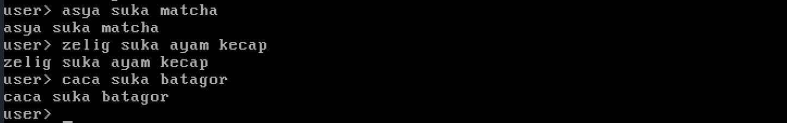
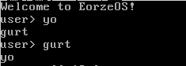
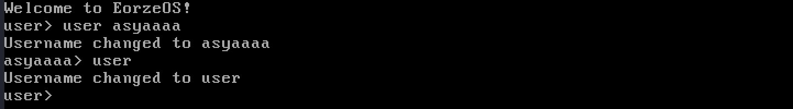
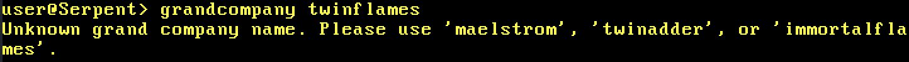
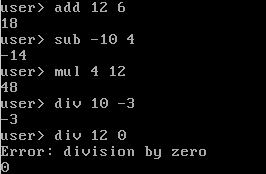
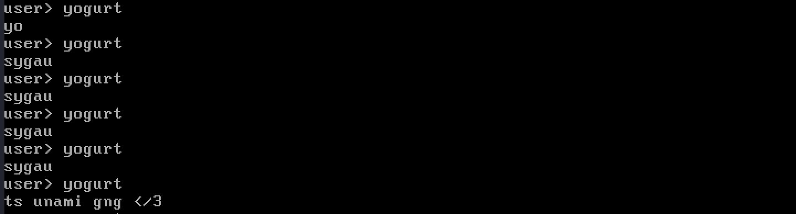

# Sisop-5-2025-IT05

## Kelompok IT05

Nama | NRP
--- | ---
Tasya Aulia D | 5027241009
Jonathan Zelig S | 5027241047
Maritza Adelia S | 5027241111

## Laporan resmi

## Soal 1
### Overview
This code is designed to echo the user’s input. Any command entered by the user will be written back exactly as it was input, followed by a carriage return and newline, if the command does not match any registered command.
### Code block
```c
else {
  printString(buf); 
  printString("\r\n"); 
}
```
### Explanation
When a user enters any text, it is stored in the buffer (buf). The shell then checks if the input matches any registered commands, and if no match is found, it prints the original input buffer followed by a carriage return and newline (\r\n).

### Input/&Output


## Soal 2
### Overview
The code implements a simple shell that responds to custom commands. For this task, the focus is on the yo and gurt commands that mimic each other’s output.

### Code block
#### shell.c
```c
else if (strcmp(cmd, "yo") == 0) {
  printString("gurt\r\n");
}

else if (strcmp(cmd, "gurt") == 0) {
  printString("yo\r\n");
}

```
### Explanation
> When the user types yo, the shell prints "gurt".
> When the user types gurt, the shell prints "yo".
> The implementation simply uses strcmp() to match the input and printString() to display the output.

### Input/&Output


## Soal 3
### Overview
The code will change the username to <username> when the user types 'user <username>'.
If no specific username is provided, only "user", the code will reset the username to the default user.

### Code block
#### shell.c
```c
static char current_username[64] = "user"; // Default username

else if(strcmp(cmd, "user") == 0) { 
  if (arg[0][0] == '\0') { // If no argument provided
    strcpy(current_username, "user"); // Reset to default
  }
  else { // If argument provided
    strcpy(current_username, arg[0]); // Update username
  }
  printString("Username changed to ");
  printString(current_username);
  printString("\r\n");
}
```
### Explanation
> It compares the parsed cmd (first input of sentence) with "user". If it's true, and if the user types user (no argument), reset current_username to "user".
> If the user types user <new_username>, copy <new_username> into current_username. It then prints a confirmation message.

### Input/&Output


## Soal 4
### Overview
This code changes the terminal's color and prompt based on the selected Grand Company (Maelstrom, Twin Adder, or Immortal Flames). Each company assigns a specific color (red, yellow, or blue) and updates the prompt. Invalid or empty inputs show an error, and the "clear" command resets the terminal to its default state.

### Code block
#### shell.c - Grand Company State Tracking
```c
static int current_grand_company = 0;  // 0=None, 1=Maelstrom, 2=Twin Adder, 3=Immortal Flames

static void printUsername() {
  printString(current_username);
  if (current_grand_company == 1) printString("@Storm");
  else if (current_grand_company == 2) printString("@Serpent");
  else if (current_grand_company == 3) printString("@Flame");
  printString("> ");
}
```
### Explanation
> This static variable current_grand_company tracks which Grand Company the user has joined, where 0 means none, 1 is Maelstrom, 2 is Twin Adder, and 3 is Immortal Flames. The printUsername() function dynamically modifies the command prompt by appending the corresponding company suffix like "@Storm" or "@Serpent" to the username, visually reflecting the user's allegiance in the terminal.

#### kernel.c - Color Handling
```c
static unsigned char current_text_color = 0x07; // Default text color (light gray on black background)

void setTextColor(unsigned char color)
{
  current_text_color = color; // Set the current text color
}
```
### Explanation
> The current_text_color variable stores the active terminal color attribute using BIOS color codes, initialized to default light gray (0x07). The setTextColor() function allows changing this global color setting, which affects all subsequent text output by modifying the value stored in current_text_color.

#### kernel.c - Command Handlers
```c
if(buf[0] != '\0') { // if buffer is not empty

       // if the command is "grandcompany"
       if(strcmp(cmd, "grandcompany") == 0) { 
        if (arg[0][0] == '\0') { // if there are no continued name after cmd
          printString("Please specify a grand company name. Please use 'maelstrom', 'twinadder', or 'immortalflames'.\r");
        }
        else if (strcmp(arg[0], "maelstrom") == 0) { // if the argument is "Maelstrom"
          setTextColor(0x0C); // set text color to light red
          current_grand_company = 1; // set grand company to Maelstrom
          clearScreen(); // clear the screen
        }
        else if (strcmp(arg[0], "twinadder") == 0) { // if the argument is "Twin Adder"
          setTextColor(0x0E); // set text color to light yellow
          current_grand_company = 2; // set grand company to Twin Adder
          clearScreen(); // clear the screen
        }
        else if (strcmp(arg[0], "immortalflames") == 0) { // if the argument is "Immortal Flames"
          setTextColor(0x09); // set text color to light blue
          current_grand_company = 3; // set grand company to Immortal Flames
          clearScreen(); // clear the screen
        } else {
          printString("Unknown grand company name. Please use 'maelstrom', 'twinadder', or 'immortalflames'.\r\n");
        }
      }
```
### Explanation
> This command handler processes the grandcompany keyword, first verifying if a valid company name argument (maelstrom/twinadder/immortalflames) is provided. When recognized, it updates both the terminal color via setTextColor() and the company ID state, then triggers clearScreen() to immediately apply the visual changes globally.

### Input/&Output




## Soal 5
### Overview
This task implements a simple calculator system in the shell that supports four operations: addition, subtraction, multiplication, and division using commands.

### Code block
#### std_lib.c
```c
int div(int a, int b) {
  if (b == 0) {
    printString("Error: division by zero\r\n");
    return 0;
  }
  int negative = 0, res = 0;
  if (a < 0) { a = -a; negative = !negative; }
  if (b < 0) { b = -b; negative = !negative; }
  while (a >= b) { a -= b; res++; }
  return negative ? -res : res;
}
```
### Explanation
> This function manually calculates integer division by repeatedly subtracting b from a, counting how many times it fits. This is done to avoid using the / operator, which may not be available or allowed in low-level or custom kernel environments. It also checks for division by zero and handles sign adjustments for negative numbers.

```c
int mod(int a, int b)
{
   return a - div(a, b) * b;
}
```
### Explanation
> It’s used inside itoa() to get each digit of a number (e.g., 123 % 10 = 3) without using the % operator.

```c
void atoi(char *str, int *num) {
  int i = 0, res = 0, negative = 0;
  if (str[0] == '-') { negative = 1; i++; }
  while (str[i] != '\0') {
    res = res * 10 + (str[i] - '0');
    i++;
  }
  *num = negative ? -res : res;
}
```
### Explanation
> Converts a string (like "123" or "-45") into an integer by parsing each character digit and assembling the result. This is essential to process user input in string form and turn it into integers for arithmetic.

```c
void itoa(int num, char *str) {
  int i = 0, negative = 0;
  if (num == 0) { str[i++] = '0'; str[i] = '\0'; return; }
  if (num < 0) { negative = 1; num = -num; }
  while (num > 0) {
    str[i++] = mod(num, 10) + '0';
    num = div(num, 10);
  }
  if (negative) str[i++] = '-';
  str[i] = '\0';

  // reverse string
  int start = 0, end = i - 1;
  while (start < end) {
    char temp = str[start];
    str[start++] = str[end];
    str[end--] = temp;
  }
}
```
### Explanation
> This function converts an integer into its string representation by extracting digits from right to left using modulo and division, storing them in reverse, and finally flipping the string. It avoids using % and / directly by calling custom mod and div.

### Code block
#### shell.c
```c
else if (strcmp(cmd, "add") == 0) {
        int x, y;
        char result[64];
        atoi(arg[0], &x);
        atoi(arg[1], &y);
        itoa(x + y, result);
        printString(result);
        printString("\r\n");
      }

      else if (strcmp(cmd, "sub") == 0) {
        int x, y;
        char result[64];
        atoi(arg[0], &x);
        atoi(arg[1], &y);
        itoa(x - y, result);
        printString(result);
        printString("\r\n");
      }

       else if (strcmp(cmd, "mul") == 0) {
        int x, y;
        char result[64];
        atoi(arg[0], &x);
        atoi(arg[1], &y);
        itoa(x * y, result);
        printString(result);
        printString("\r\n");
      }

      else if (strcmp(cmd, "div") == 0) {
        int x, y;
        char result[64];
        atoi(arg[0], &x);
        atoi(arg[1], &y);
        itoa(div(x, y), result); // pakai div buatan sendiri
        printString(result);
        printString("\r\n");
      }
```
### Explanation
> The shell reads 2 arguments (x, y), converts them from strings to integers using atoi().
> Performs the corresponding operation (+, -, *, or / using custom div()).
> Converts the result back to string using itoa() and prints it.

### Input/&Output


## Soal 6
### Overview
When the user types 'yogurt', the system will respond with a random part of the word or phrase each time. For instance, the first time the user types 'yogurt', it will return 'yo', the second time it will return 'ts unami gng </3', and the third time it will respond with 'sygau'. This process continues in a random selection of these responses.

### Code block
#### shell.c
```c
else if (strcmp(cmd, "yogurt") == 0) {
  unsigned int randomValue = getBiosTick();
  int remainder = mod(randomValue, 3);
  printString("\r");
  if (remainder == 0) {
    printString("\ryo\r\n");
  } else if (remainder == 1) {
    printString("\rts unami gng </3\r\n");
  } else {
    printString("\rsygau\r\n");
  }
}
```
### Explanation
> It calls getBiosTick() to get a "random" system timer value, uses mod() to compute randomValue % 3, yielding 0, 1, or 2.
> Prints a different response based on the remainder:
> 0 → "yo"
> 1 → "ts unami gng </3"
> 2 → "sygau"

### Input/&Output


## Soal 7
### Overview
Makefile automates the build process for your operating system, creating a bootable floppy disk image.
### Code block
#### Makefile
```c
.PHONY: prepare bootloader stdlib shell kernel link build

build: prepare bootloader stdlib shell kernel link

prepare:
	dd if=/dev/zero of=bin/floppy.img bs=512 count=2880

bootloader:
	nasm -f bin src/bootloader.asm -o bin/bootloader.bin

stdlib:
	bcc -ansi -c -o bin/std_lib.o src/std_lib.c -Iinclude

shell:
	bcc -ansi -c -o bin/shell.o src/shell.c -Iinclude

kernel:
	bcc -ansi -c -o bin/kernel.o src/kernel.c -Iinclude
	nasm -f as86 src/kernel.asm -o bin/kernel_asm.o
	nasm -f as86 src/kernel.asm -o bin/kernel.bin	

link:
	ld86 -o bin/kernel.bin -d bin/kernel.o bin/kernel_asm.o bin/std_lib.o bin/shell.o
	dd if=bin/bootloader.bin of=bin/floppy.img bs=512 count=1 conv=notrunc
	dd if=bin/kernel.bin of=bin/floppy.img bs=512 seek=1 conv=notrunc
```
### Explanation
> The process begins by initializing a blank floppy disk image, followed by building a bootloader for sector 0 and compiling essential components such as the standard library, shell logic, and kernel code. These components are then linked into a single kernel binary, and the bootable OS image is assembled by combining the bootloader and kernel binary, resulting in a final bin/floppy.img file.
